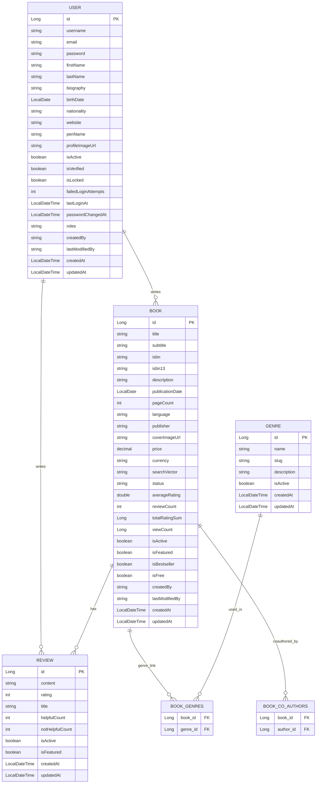

# Entity Relationship Diagram (ERD)

---

# ER Diagram Documentation (Entities & Relationships)

## 1. User
- **Fields:** id, username, email, password, roles, etc.
- **Relationships:**
  - @OneToMany authored books
  - @ManyToMany co-authored books
  - @OneToMany reviews

## 2. Book
- **Fields:** id, title, isbn, description, status, averageRating, etc.
- **Relationships:**
  - @ManyToOne author (User)
  - @ManyToMany co-authors (User)
  - @ManyToMany genres
  - @OneToMany reviews

## 3. Review
- **Fields:** id, content, rating, isActive, isFeatured, etc.
- **Relationships:**
  - @ManyToOne user
  - @ManyToOne book

## 4. Genre
- **Fields:** id, name, slug, description
- **Relationships:**
  - @ManyToMany books

## 5. Join Tables
- **BOOK_GENRES:** Join table for many-to-many between books and genres.
- **BOOK_CO_AUTHORS:** Join table for many-to-many between books and users (co-authors).

---

# Index, Fetch, and Cascade Strategies

## Index Choices
| Table              | Indexed Fields                                      | Purpose                                 |
|--------------------|----------------------------------------------------|-----------------------------------------|
| books              | title, isbn, author_id, average_rating, publication_date, status, search_vector | Fast search, filtering, and sort        |
| reviews            | user_id, book_id, rating, created_at                | Efficient fetch by user/book            |
| genres             | name, slug                                         | Fast lookup of genres                   |
| book_genres        | book_id, genre_id                                  | Fast lookup of books by genre           |

### Unique Constraints
- `isbn` in Book
- `user_id + book_id` in Review (prevents duplicate reviews)
- Unique email/username in User

## Fetch Strategies
| Relationship                                 | Strategy | Reason                                      |
|----------------------------------------------|----------|---------------------------------------------|
| @ManyToOne (User → Book, User → Review)      | LAZY     | Avoid loading user details unless required  |
| @OneToMany (Book → Reviews, User → Reviews)  | LAZY     | Reviews are often not needed immediately    |
| @ManyToMany (Book → Genres, Book → CoAuthors)| LAZY     | Keep memory and join queries optimized      |
| User.roles                                   | EAGER    | Needed for security                         |

## Cascade Behavior
| Relationship                                              | Cascade         | Reason                                         |
|----------------------------------------------------------|-----------------|------------------------------------------------|
| @OneToMany(mappedBy="book", cascade = ALL) → Reviews    | All             | Reviews should be created/deleted with book    |
| @ManyToMany(fetch = LAZY, cascade = {PERSIST, MERGE}) → Genres | Persist/Merge | Don't delete genres if a book is deleted   |
| @ManyToOne                                              | No Cascade      | User should remain even if book/review is deleted |

## Data Integrity Constraints
- Unique email/username: Prevents duplicate accounts
- Unique ISBN: Ensures book uniqueness
- Unique user-book review: One review per user per book
- Rating validation: 1-5 range enforced

---

# Design Decisions & Rationale
- Indexes are strategically applied to fields queried or joined frequently.
- Lazy fetch strategy avoids performance issues and reduces unnecessary DB access.
- Cascade operations are added where parent-child dependency is strong (e.g. book → review). 

