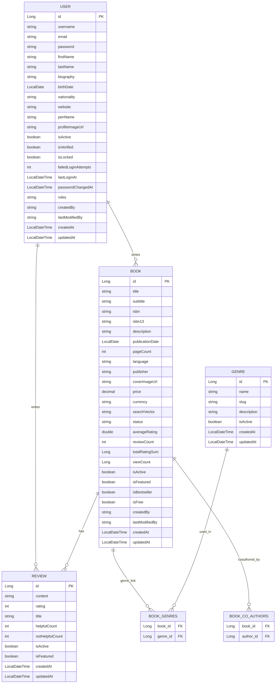

# Entity Relationship Diagram (ERD)




# ER Diagram Documentation (Entities & Relationships)

## 1. User
**Fields:** id, username, email, password, roles, etc.

**Relationships:**
- @OneToMany authored books
- @ManyToMany co-authored books
- @OneToMany reviews

## 2. Book
**Fields:** id, title, isbn, description, status, averageRating, etc.

**Relationships:**
- @ManyToOne author (User)
- @ManyToMany co-authors (User)
- @ManyToMany genres
- @OneToMany reviews

## 3. Review
**Fields:** id, content, rating, isActive, isFeatured, etc.

**Relationships:**
- @ManyToOne user
- @ManyToOne book

## 4. Genre
**Fields:** id, name, slug, description

**Relationships:**
- @ManyToMany books

---

## 📌 Index Choices

### ✅ Why Use Indexes?
Indexes are added to improve performance for filtering, searching, sorting, and joining large datasets.

### ✅ Indexes Used
| Table              | Indexed Fields                                      | Purpose                                 |
|--------------------|----------------------------------------------------|-----------------------------------------|
| books              | title, isbn, author_id, average_rating, publication_date, status, search_vector | Fast search, filtering, and sort        |
| reviews            | user_id, book_id, rating, created_at                | Efficient fetch by user/book            |
| genres             | name, slug                                         | Fast lookup of genres                   |
| book_genres        | book_id, genre_id                                  | Fast lookup of books by genre           |

### ✅ Unique Constraints
- `isbn` in Book
- `user_id + book_id` in Review (prevents duplicate reviews)

---

## ⚙️ Fetch Strategies
| Relationship                                 | Strategy | Reason                                      |
|----------------------------------------------|----------|---------------------------------------------|
| @ManyToOne (User → Book, User → Review)      | LAZY     | Avoid loading user details unless required  |
| @OneToMany (Book → Reviews, User → Reviews)  | LAZY     | Reviews are often not needed immediately    |
| @ManyToMany (Book → Genres, Book → CoAuthors)| LAZY     | Keep memory and join queries optimized      |

### 🔍 Why mostly LAZY?
To reduce memory consumption and prevent unnecessary JOINs. You can use `@EntityGraph` or manual `.fetchJoin()` when needed eagerly.

---

## 🔄 Cascade Behavior
| Relationship                                              | Cascade         | Reason                                         |
|----------------------------------------------------------|-----------------|------------------------------------------------|
| @OneToMany(mappedBy="book", cascade = ALL) → Reviews    | All             | Reviews should be created/deleted with book    |
| @ManyToMany(fetch = LAZY, cascade = {PERSIST, MERGE}) → Genres | Persist/Merge | Don't delete genres if a book is deleted   |
| @ManyToOne                                              | No Cascade      | User should remain even if book/review is deleted |

---

## ✅ Summary
- Indexes are strategically applied to fields queried or joined frequently.
- Lazy fetch strategy avoids performance issues and reduces unnecessary DB access.
- Cascade operations are added where parent-child dependency is strong (e.g. book → review). 


# Book Review Platform - Data Schema & Design Documentation

## Entity Relationship Diagram

**Legend:**
- **PK**: Primary Key
- **FK**: Foreign Key
- **UK**: Unique Constraint
- `[]`: Array/Set
- 1/∞: One/Many

```
┌─────────────────────┐         ┌─────────────────────┐
│        USER         │         │        BOOK         │
├─────────────────────┤         ├─────────────────────┤
│ PK: id              │         │ PK: id              │
│ UK: username        │    1    │ UK: isbn            │
│ UK: email           │ ─────── │ FK: author_id       │
│    password         │    ∞    │    title            │
│    first_name       │         │    subtitle         │
│    last_name        │         │    description      │
│    roles[]          │         │    publication_date │
│    is_active        │         │    average_rating   │
│    created_at       │         │    review_count     │
└─────────────────────┘         └─────────────────────┘
         │                               │
         │                               │
         │ 1                             │ 1
         │                               │
         │                               │
         ∞                               ∞
┌─────────────────────┐         ┌─────────────────────┐
│       REVIEW        │         │    BOOK_GENRES      │
├─────────────────────┤         ├─────────────────────┤
│ PK: id              │         │ FK: book_id         │
│ FK: user_id         │         │ FK: genre_id        │
│ FK: book_id         │         └─────────────────────┘
│ UK: user_id+book_id │                   │
│    content          │                   │
│    rating           │                   ∞
│    title            │         ┌─────────────────────┐
│    helpful_count    │         │       GENRE         │
│    created_at       │         ├─────────────────────┤
└─────────────────────┘         │ PK: id              │
                                │ UK: name            │
                                │ UK: slug            │
                                │    description      │
                                │    is_active        │
                                └─────────────────────┘

┌─────────────────────┐
│  BOOK_CO_AUTHORS    │
├─────────────────────┤
│ FK: book_id         │
│ FK: author_id       │
└─────────────────────┘
```

- **BOOK_GENRES**: Join table for many-to-many between books and genres.
- **BOOK_CO_AUTHORS**: Join table for many-to-many between books and users (co-authors).

## Design Decisions & Rationale

### 1. Index Strategy Explanation

| Index Name | Purpose | Justification |
|------------|---------|---------------|
| `idx_books_title` | Book search by title | Most common search pattern |
| `idx_books_isbn` | Unique book identification | Standard book lookup |
| `idx_books_author` | Books by author queries | Common browsing pattern |
| `idx_books_avg_rating` | Sorting by rating | Popular books, recommendations |
| `idx_books_title_author` | Combined search | Optimizes "title by author" queries |
| `idx_books_search` | Full-text search | PostgreSQL tsvector for search |
| `idx_reviews_user_book` | User's review lookup | Prevents duplicates, fast retrieval |
| `idx_users_email` | Login authentication | Primary login method |
| `idx_users_username` | Alternative login | Secondary authentication |

### 2. Fetch Strategy Decisions

| Relationship | Strategy | Reasoning |
|--------------|----------|-----------|
| `Book.author` | LAZY | Author details not always needed |
| `Book.genres` | LAZY | Genre list can be large |
| `Book.reviews` | LAZY | Reviews are paginated |
| `User.roles` | EAGER | Small set, needed for security |
| `Review.user` | LAZY | User details loaded on demand |
| `Review.book` | LAZY | Book details loaded on demand |

### 3. Cascade Strategy

| Relationship | Cascade | Reasoning |
|--------------|---------|-----------|
| `Book -> Reviews` | ALL | Reviews belong to books |
| `User -> Reviews` | ALL | User owns their reviews |
| `Book -> Genres` | PERSIST, MERGE | Genres are shared entities |
| `User -> Books` | ALL | Authors own their books |

### 4. Data Integrity Constraints

#### Primary Constraints
- **Unique email/username**: Prevents duplicate accounts
- **Unique ISBN**: Ensures book uniqueness
- **Unique user-book review**: One review per user per book
- **Rating validation**: 1-5 range enforced

#### Business Rules
- **Page count > 0**: Validates book data
- **Price >= 0**: Prevents negative pricing
- **Default roles**: New users get READER role
- **Soft deletes**: Using `is_active` flags

## Conclusion

This schema design prioritizes:
1. **Performance**: Strategic indexing and denormalization
2. **Integrity**: Comprehensive constraints and validation
3. **Scalability**: Efficient relationships and query patterns
4. **Security**: Robust user management and access control
5. **Maintainability**: Clear entity boundaries and audit trails

The design supports all core requirements while providing flexibility for future enhancements.