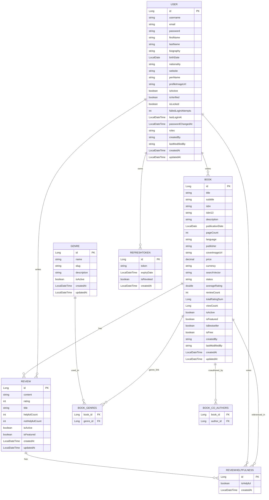

# Entity Relationship Diagram (ERD)

# ER Diagram Documentation (Entities & Relationships)

## 1. User
**Fields:** id, username, email, password, roles, etc.

**Relationships:**
- @OneToMany authored books
- @ManyToMany co-authored books
- @OneToMany reviews
- @OneToMany helpfulness votes
- @OneToMany refresh tokens

## 2. Book
**Fields:** id, title, isbn, description, status, averageRating, etc.

**Relationships:**
- @ManyToOne author (User)
- @ManyToMany co-authors (User)
- @ManyToMany genres
- @OneToMany reviews

## 3. Review
**Fields:** id, content, rating, isActive, isFeatured, etc.

**Relationships:**
- @ManyToOne user
- @ManyToOne book
- @OneToMany helpfulness votes

## 4. ReviewHelpfulness
**Fields:** id, isHelpful

**Relationships:**
- @ManyToOne user
- @ManyToOne review

## 5. Genre
**Fields:** id, name, slug, description

**Relationships:**
- @ManyToMany books

## 6. RefreshToken
**Fields:** id, token, expiryDate, isRevoked

**Relationships:**
- @ManyToOne user

---

## 📌 Index Choices

### ✅ Why Use Indexes?
Indexes are added to improve performance for filtering, searching, sorting, and joining large datasets.

### ✅ Indexes Used
| Table              | Indexed Fields                                      | Purpose                                 |
|--------------------|----------------------------------------------------|-----------------------------------------|
| books              | title, isbn, author_id, average_rating, publication_date, status, search_vector | Fast search, filtering, and sort        |
| reviews            | user_id, book_id, rating, created_at                | Efficient fetch by user/book            |
| genres             | name, slug                                         | Fast lookup of genres                   |
| review_helpfulness | user_id, review_id                                 | Quick lookups to avoid duplicate votes  |
| refresh_tokens     | token, user_id, expiry_date                        | Token validation and expiry handling    |

### ✅ Unique Constraints
- `isbn` in Book
- `user_id + book_id` in Review (prevents duplicate reviews)
- `user_id + review_id` in ReviewHelpfulness (prevents duplicate votes)

---

## ⚙️ Fetch Strategies
| Relationship                                 | Strategy | Reason                                      |
|----------------------------------------------|----------|---------------------------------------------|
| @ManyToOne (User → Book, User → Review)      | LAZY     | Avoid loading user details unless required  |
| @OneToMany (Book → Reviews, User → Reviews)  | LAZY     | Reviews are often not needed immediately    |
| @ManyToMany (Book → Genres, Book → CoAuthors)| LAZY     | Keep memory and join queries optimized      |
| @OneToMany (Review → Helpfulness)            | LAZY     | Only fetch votes when displaying them       |

### 🔍 Why mostly LAZY?
To reduce memory consumption and prevent unnecessary JOINs. You can use `@EntityGraph` or manual `.fetchJoin()` when needed eagerly.

---

## 🔄 Cascade Behavior
| Relationship                                              | Cascade         | Reason                                         |
|----------------------------------------------------------|-----------------|------------------------------------------------|
| @OneToMany(mappedBy="book", cascade = ALL) → Reviews    | All             | Reviews should be created/deleted with book    |
| @OneToMany(mappedBy="review", cascade = ALL) → Helpfulness | All         | Voting is embedded with review lifecycle       |
| @ManyToMany(fetch = LAZY, cascade = {PERSIST, MERGE}) → Genres | Persist/Merge | Don't delete genres if a book is deleted   |
| @ManyToOne                                              | No Cascade      | User should remain even if book/review is deleted |

---

## ✅ Summary
- Indexes are strategically applied to fields queried or joined frequently.
- Lazy fetch strategy avoids performance issues and reduces unnecessary DB access.
- Cascade operations are added where parent-child dependency is strong (e.g. book → review). 